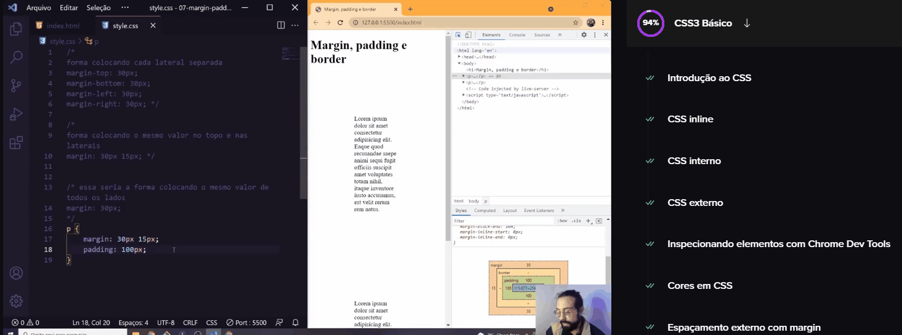

# Projeto dev-quest start
Em busca de aprender a programar encontrei o projeto dos gêmeos do Dev em Dobro e decidir aprender com eles. ✨

Nesse repositório você ira encontrar uma das coisas que aprendi no módulo de CSS básico. 🚀

## Tecnologia utilizada
- CSS básico

## Como utilizar
### 1- Clone o projeto
- git clone <https://github.com/herbert-vctor/aula-margin-padding-border.git>

### 2- Acesse a pasta
- cd 07-margin-padding-border

### 3- Abra com o VS-code
- code .

## O que aprendi ?
Como o próprio nome do repositório já diz, eu aprendi sobre o espaçamento externo com o margin, espaçamento interno com o padding e como adicionar bordas aos elementos com o border.

## Dificuldades 
Talvez por ser CSS básico ou porque o método de ensino dos gêmeos seja bom; mas eu não tive dificuldades em entender as fucionalidades das propriedades aprendidas nesta aula.